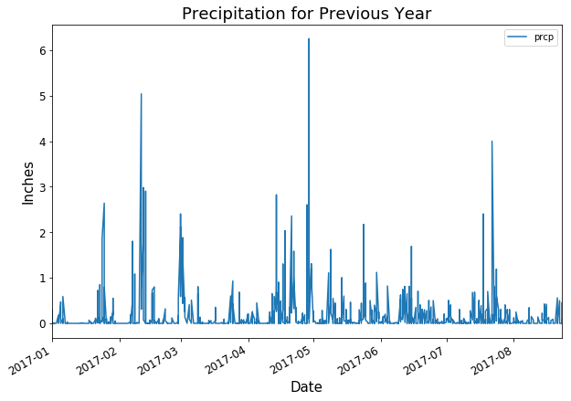
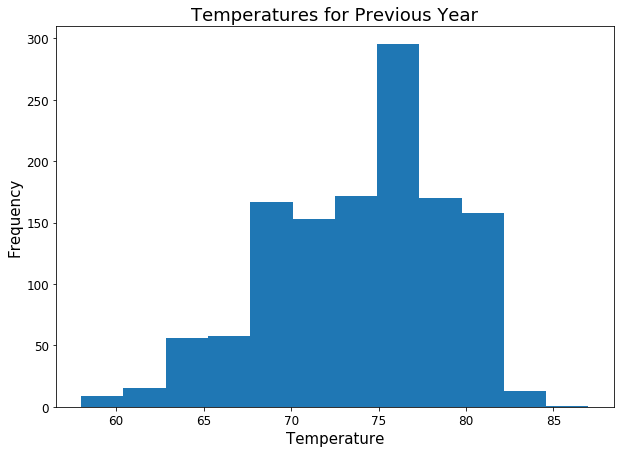
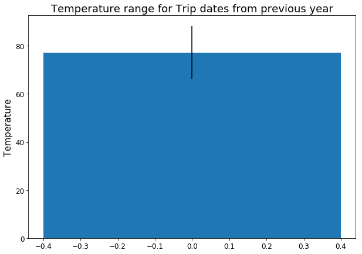

# Hawaii Vacation Planning

I created a Flask api to assist vacationers (to Hawaii) in retrieving climate data. I was provided climate measurements from 2010 to 2017 and mesurement station informtion in 2 csv files. 

## My app was created in the 4 steps below: 
___
### Step 1 - Data Engineering

I used pandas to check out the raw data. Some datetime parsing and number formatting was required to get the data ready for the next step.

[**See the raw data**](hawaii_weather/Resources)

[**See my code**](hawaii_weather/data_engineering.ipynb)

___
### Step 2 - Database Engineering

Using SQLAlchemy I created classes for the Measurements and Stations data which i mapped according to the specs of their respective csv columns. 

I was then able to create class instances for each row of data and add to a sqlite database.

[**See my code**](hawaii_weather/database_engineering.ipynb)

___
### Step 3 - Climate Analysis and Exploration

With my new sqlite database I queried for the data points below which I used to create plots. 

#### Data points queried

* The last 12 months of precipitation data:



* Total number of stations.

```python
total_stations = (session
                  .query(func.count(Station.name))
                  .scalar())

print(f'There are {total_stations} stations')

''' OUTPUT:

There are 9 stations

'''
```

* Most active stations.

```python
most_active_stations = (session
                        .query(Measurement.station, func.count(Measurement.station))
                        .group_by(Measurement.station)
                        .order_by(func.count(Measurement.station).desc())
                        .limit(3)
                        .all())

highest_measurement_count = 0
most_active_station = None

for station in most_active_stations:
    print(f'Station Name: {station[0]}\nMeasurements: {station[1]}\n')
    
    if station[1] > highest_measurement_count:
        most_active_station = station[0]
        highest_measurement_count = station[1]
            
print(f'The most active station is {most_active_station}')

''' OUTPUT:

Station Name: USC00519281
Measurements: 2772

Station Name: USC00513117
Measurements: 2696

Station Name: USC00519397
Measurements: 2685

The most active station is USC00519281

'''
```


* Min, Max, and Avg temperatures for a given date range from the previous year

```python
def calc_temps(start_date, end_date):
    # parse dates
    converted_start_date = datetime.strptime(start_date, '%Y-%m-%d').date()
    converted_end_date = datetime.strptime(end_date, '%Y-%m-%d').date()
    
    # reduce date by 1 year
    converted_start_date = converted_start_date - relativedelta(years=1)
    converted_end_date = converted_end_date - relativedelta(years=1)     
    
    print(f'these are the temp stats for {start_date} to {end_date} last year:')

    # query for min temp
    temp_min = (session
                .query(func.min(Measurement.tobs))
                .filter(Measurement.date >= converted_start_date)
                .filter(Measurement.date <= converted_end_date)
                .scalar())
    
    print(f'Min: {temp_min}')
    
    # query for max temp
    temp_max = (session
                .query(func.max(Measurement.tobs))
                .filter(Measurement.date >= converted_start_date)
                .filter(Measurement.date <= converted_end_date)
                .scalar())  
    
    print(f'Max: {temp_max}')    
    
    # query for average temp
    temp_avg = (session
                .query(func.avg(Measurement.tobs))
                .filter(Measurement.date >= converted_start_date)
                .filter(Measurement.date <= converted_end_date)
                .scalar())

    print(f'Avg: {temp_avg}')
    
    # return dictionary of temp stats
    return {'min': temp_min, 'max': temp_max, 'avg': temp_avg}

# define trip start and trip end date
trip_start = '2018-06-02'
trip_end = '2018-06-18'

# pull stats for trips dates in the previous year
trip_stats = calc_temps(trip_start, trip_end)

''' OUTPUT:

these are the temp stats for 2018-06-02 to 2018-06-18 last year:
Min: 72.0
Max: 83.0
Avg: 77.27173913043478

'''
```


[**See my code**](hawaii_weather/climate_analysis.ipynb)
___
### Step 4 - Create API

* Finally, I created a Flask API with the endpooints below

  * `/api/v1.0/precipitation`

    * Returns the json list of dictionaries with precipitation measurements from the last year.

  * `/api/v1.0/stations`

    * Returns a json list of stations from the dataset.

  * `/api/v1.0/tobs`

    * Returns a json list of Temperature Observations (tobs) for the previous year

  * `/api/v1.0/<start>` and `/api/v1.0/<start>/<end>`

    * Returns a json list of the minimum temperature, the average temperature, and the max temperature for a given start or start-end range.

[**See my code**](hawaii_weather/hi_weather_api.py)